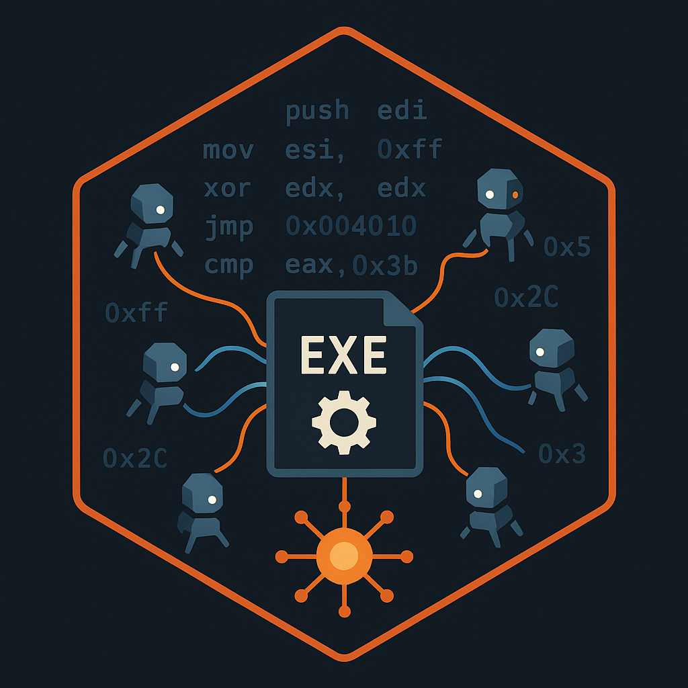

# 

# IDA Swarm

**Multi-Agent AI System for Autonomous Binary Analysis and Modification**

## Demo

[](https://www.youtube.com/watch?v=6F0HhH0ZPXI)

## Overview

IDA Swarm is an advanced AI orchestration system that extends IDA Pro's capabilities through coordinated multi-agent binary analysis. The system implements sophisticated task decomposition, parallel analysis with isolated database copies, and intelligent conflict resolution when agents produce conflicting modifications.

**Key Innovation**: Rather than a single AI attempting binary analysis, IDA Swarm spawns specialized agents that work in parallel on database copies, merge their findings, and resolve conflicts through structured debate when modifications overlap.

> **Note**: This is an active research project built around IDA Pro 9.0 beta (9.0.240807). Expect bugs and instability as new capabilities are explored.

## Core Architecture

### Multi-Agent Orchestration

```
        ┌──────────────────────────┐
        │     IDA Pro Instance     │
        │  ┌────────────────────┐  │
        │  │    Orchestrator    │  │
        │  │   (Qt UI Dialog)   │  │
        │  └──────────┬─────────┘  │
        └─────────────┼────────────┘
                      │ Process Spawn
     ┌────────────────┼────────────────┐
     ▼                ▼                ▼
┌─────────┐    ┌─────────┐    ┌─────────┐
│ Agent 1 │    │ Agent 2 │    │ Agent N │
│  (IDA)  │◄──►│  (IDA)  │◄──►│  (IDA)  │
└─────────┘    └─────────┘    └─────────┘
     ▲                ▲                ▲
     └────────────────┼────────────────┘
              IRC Communication
                  (Swarm)
```

**Components:**
- **Orchestrator**: Decomposes tasks and spawns specialized analysis agents
- **Agents**: Independent IDA Pro processes working on isolated database copies
- **IRC Server**: Facilitates agent communication for conflict resolution
- **Event Bus**: Real-time coordination and status updates
- **Merge Manager**: Intelligently combines agent findings into main database

### External Tool Integration (Optional)

```
┌─────────────────────────────────────────────────────────────┐
│                  External Tools (Claude Code, etc)          │
└────────────────────┬────────────────────────────────────────┘
                     │ MCP Protocol (JSON-RPC)
        ┌────────────▼────────────┐
        │   MCP Server (Optional) │
        │  (Session Management)   │
        └────────────┬────────────┘
                     │ File-based IPC
        ┌────────────▼────────────┐
        │     Orchestrator        │
        └────────────┬────────────┘
                     │ Process Spawn
     ┌───────────────┼───────────────┐
     ▼               ▼               ▼
┌─────────┐    ┌─────────┐    ┌─────────┐
│ Agent 1 │    │ Agent 2 │    │ Agent N │
│  (IDA)  │◄──►│  (IDA)  │◄──►│  (IDA)  │
└─────────┘    └─────────┘    └─────────┘
```

The MCP server enables integration with external tools while maintaining the multi-agent architecture.

## Technical Capabilities

### 1. Multi-Agent Analysis System

**Independent Parallel Analysis**
- Orchestrator spawns specialized agents based on task decomposition
- Each agent runs in its own IDA Pro process with isolated database copy
- Agents work independently without biasing each other's analysis
- Results are merged after completion

**Conflict Resolution**
- When agents produce conflicting modifications (different names, types, or patches for the same location)
- Dedicated IRC channels created for structured debate
- Agents present reasoning and evidence
- Consensus required before modifications applied
- Orchestrator enforces agreed solutions

**Quality Control**
- Grader system evaluates agent work before presenting to orchestrator
- Agents use extensive thinking/reflection during analysis
- Deep analysis mode for extraordinarily complex tasks (delegated to more powerful models)

### 2. Binary Patching System

The patching system provides four levels of binary modification, allowing agents to work at the appropriate abstraction level for each task:

**Level 1: Byte-Level Patching**
- Direct hex modification of raw binary data
- Change constants, strings, or individual bytes within data sections
- Precise control for data structure modifications
- Example: Modify hardcoded IP addresses, change magic bytes, flip feature flags in configuration data

**Level 2: Assembly Instruction Patching**
- Patch individual machine instructions at the assembly level
- Multi-architecture support via Keystone assembler (x86, x64, ARM, ARM64, MIPS, PPC, SPARC)
- Replace instructions while maintaining correct encoding
- Example: Change `jz` to `jnz`, NOP out security checks, modify jump targets, replace function calls

**Level 3: Code Injection (via Code Injection Manager)**
- Inject larger blocks of custom assembly code
- Three-stage workflow: develop in temporary workspace, preview disassembly, relocate to permanent location
- Automatic code cave detection and segment creation
- Multi-agent coordination via no-go zones prevents allocation conflicts
- Example: Add instrumentation hooks, implement custom protocol handlers, inject logging routines

**Level 4: Semantic Patching (detailed in section 4)**
- Complete function replacement at C source level
- Decompile → modify in C → recompile → inject
- Automatic symbol resolution and ABI compatibility verification
- Example: Rewrite authentication algorithms, add complex security checks, replace cryptographic implementations

**Dual Patching System**

All modifications are applied to both IDA database AND the actual binary file:
- Changes persist across IDA sessions and remain in the analysis database
- Modified binaries can be executed with patches applied
- Real-time replication: patches broadcast to all agents immediately
- Prevents database/binary divergence that would break analysis

**Safety Features**
- Original bytes verification before patching
- Instruction boundary validation
- Patch size checking to prevent adjacent code corruption
- Complete audit trail with timestamps and descriptions
- Reversible: patches can be reverted individually or all at once

### 3. Code Injection System

**Three-Stage Workflow**

The Code Injection Manager provides infrastructure for injecting larger blocks of assembly code into binaries:

**Stage 1: Workspace Allocation**
- Allocate temporary IDA segment for code development
- Agent iteratively develops/tests code using patch tools
- Address is temporary and will change

**Stage 2: Preview** *(Mandatory)*
- View complete disassembly of developed code
- Verify functionality before finalization
- Check for addressing issues or bugs

**Stage 3: Finalization**
- Find permanent location (code cave or new segment)
- Relocate code to permanent address
- Update all references to use new address
- Inject into actual binary file

**Coordination Features:**
- **No-go zones**: Agents broadcast claimed regions to prevent conflicts
- **Code cave detection**: Automatically finds unused space in binaries
- **Dual injection**: Updates both IDA database and binary file

### 4. Semantic Patching (C-Level Binary Modification)

**Decompile-Modify-Recompile Workflow**

Rather than tedious assembly-level patching for complex logic changes, work at the C source level. The semantic patcher builds on the Code Injection System to inject compiled C code:

**Stage 1: start_semantic_patch()**
- Decompile function via Hex-Rays
- Detect calling convention (System V x64, MS x64, cdecl, stdcall, fastcall, ARM AAPCS, etc.)
- Return C code to agent for modification

**Stage 2: compile_replacement()**
- Agent provides modified C code
- Automatic symbol resolution: undefined functions resolved via IDA database
  - `other_function()` → `#define other_function ((int(*)(void))0x401000)`
- Compile with matching calling convention
- Return compiled assembly + resolved symbols for verification

**Stage 3: preview_semantic_patch()** *(Mandatory Safety Gate)*
- Analyze compiled assembly's calling convention
- Verify ABI compatibility with original
- Show before/after comparison
- **Block finalization if incompatible** (prevents crashes)

**Stage 4: finalize_semantic_patch()**
- Inject compiled code into binary using Code Injection Manager
- Patch original function with JMP to replacement
- Original function now executes modified logic

**Why This Matters:**
- Modify complex algorithms without assembly expertise
- Add instrumentation, logging, or security checks at C level
- Compiler handles register allocation and optimization
- Safety verification prevents ABI mismatches that would crash

**Example**: Replace authentication function's algorithm, add logging to network functions, or implement custom protocol parsers - all in C rather than assembly.

### 5. Comprehensive Tool System

**40+ Analysis Tools** including:

**Navigation & Discovery:**
- Search functions/globals/strings/types by pattern
- Cross-reference analysis (to/from any address)
- Import/export enumeration
- Function and data information queries

**Modification:**
- Set names, comments, and types
- Define structures and enums
- Modify function prototypes and calling conventions
- Update local variables and parameters
- Data structure definition and manipulation

**Advanced Analysis:**
- Function analysis with disassembly/decompilation
- Memory dumping for untyped data
- Type system manipulation
- Variable and prototype modification
- Python execution for custom computation

**Binary Modification:**
- Byte-level patching with verification
- Assembly patching with multi-architecture support
- Code workspace allocation and management
- Code injection preview and finalization
- Semantic patching (C-level modification)

### 6. Conflict Resolution Protocol

**The Design Challenge:**

When multiple agents work in parallel, conflicts arise:
- **Analysis conflicts**: Different names/types for the same function/data
- **Patch conflicts**: Different modifications to the same address

**Resolution Process:**

1. **Detection**: System detects conflicting tool calls
2. **Channel Creation**: Dedicated IRC channel (`#conflict_address_tool`) created
3. **Structured Debate**: Agents join channel and present reasoning
4. **Consensus**: All participating agents must agree on solution
5. **Enforcement**: Orchestrator applies agreed modification

**For Analysis Conflicts** (names, types, comments):
- Agents seek "most accurate" representation
- Evidence-based discussion
- Best analysis wins

**For Patch Conflicts** (binary modifications):
- No "correct" answer - agents may have different valid goals
- Negotiation to find compatible solution
- May require rethinking both approaches

This protocol prevents race conditions while preserving the benefits of parallel analysis.

### 7. Integration Capabilities

**MCP Server Integration**
- Model Context Protocol server for external tool integration
- Session management with deterministic session IDs
- File-based IPC for orchestrator communication
- Background mode for parallel analysis of multiple binaries
- Compatible with Claude Code and other MCP clients

**File I/O:**
- Orchestrator can create files (scripts, reports, configs)
- Default location: next to analyzed binary
- Custom paths supported

**Profiling:**
- Detailed performance metrics when enabled
- Tool execution timing
- API call statistics
- Token usage tracking

## Prerequisites

### Required Software

1. **IDA Pro 9.0 Beta** (Version 9.0.240807)
   - Process architecture used due to IDAlib limitations in this beta version
   - Future versions may enable more elegant integration

2. **Qt 5.15.2** (IDA's custom build required)
   - Download from: https://hex-rays.com/blog/ida-8-4-qt-5-15-2-sources-build-scripts
   - macOS: Extract to `/Users/Shared/Qt/5.15.2-arm64` (directory name must include -arm64)
   - Linux: Extract to `/path/to/qt-5.15.2-amd64`

3. **Build Tools**
   - CMake 3.16+
   - C++20 compliant compiler (Clang 14+, GCC 11+, MSVC 2022+)
   - Keystone assembler (built automatically via CMake)
   - LIEF (built automatically via CMake)

4. **Anthropic API Access**
   - API key or OAuth credentials for Claude models
   - Sonnet 4.5 recommended for agents and grader

## Installation

### 1. Clone Repository

```bash
git clone https://github.com/shells-above/ida-swarm.git
cd ida-swarm
```

### 2. Configure Build

Edit `CMakeLists.txt` to set your paths:

```cmake
# IDA SDK path
set(IDASDK_PATH "/path/to/idasdk90")

# IDA Pro plugins directory
set(IDA_PLUGINS_PATH "/path/to/ida/plugins")

# Qt installation (IDA's custom build)
set(QTDIR "/path/to/qt-5.15.2")
```

### 3. Build Project

```bash
mkdir build && cd build
cmake ..
make -j$(nproc)
make install      # Installs plugin to IDA plugins directory
```

The build process will automatically:
- Download and build Keystone assembler
- Download and build LIEF for binary manipulation
- Configure all dependencies
- Install the plugin to your IDA plugins directory

### 4. Configure API Access

#### API Key

```bash
cp llm_re_config.json.example ~/.idapro/llm_re_config.json
```

Edit with your API key:
```json
{
  "api": {
    "auth_method": "api_key",
    "api_key": "sk-ant-..."
  }
}
```

### 5. Optional: MCP Server for External Tools

```bash
# Build creates ida_swarm_mcp executable in build directory
mkdir ~/.ida_swarm_mcp
cp build/ida_swarm_mcp ~/.ida_swarm_mcp/

# Configure MCP server
cat > ~/.ida_swarm_mcp/server_config.json << EOF
{
    "max_sessions": 25,
    "ida_path": "/path/to/ida64"
}
EOF
```

## Usage

### Direct IDA Pro Usage

1. Open your target binary in IDA Pro
2. Wait for initial auto-analysis to complete
3. Run plugin: `Edit → Plugins → IDA Swarm`
4. Enter your analysis request in the dialog

The orchestrator will decompose your request, spawn specialized agents, and synthesize their findings.

### MCP Server Usage (for Claude Code integration)

See `skills/ida-swarm/SKILL.md` for detailed MCP usage patterns.

**Basic workflow:**
```python
# Start analysis session
session = start_analysis_session(
    binary_path="/path/to/binary",
    task="Find and analyze all network communication functions"
)

# Continue analysis
send_message(
    session_id=session["session_id"],
    message="Focus on the functions that handle DNS resolution"
)

# Close when done
close_session(session_id=session["session_id"])
```

## Known Issues & Current Limitations

### IDA Integration
- Built around IDA Pro 9.0.240807 beta where IDAlib has limitations
- Process-based architecture used as workaround (spawning separate IDA instances)
- Future IDA versions may enable cleaner integration

### Platform-Specific
- macOS: Uses launchd for process spawning due to terminal limitations
- IRC server requires available ports (dynamically allocated)
- File-based IPC may have latency on network filesystems

### Workarounds

**Session Issues:**
- If analysis hangs: Check `/tmp/ida_swarm_sessions/{session_id}/ida.err` for errors
- Verify IDA process running: `ps aux | grep ida64`
- Check orchestrator log: `/tmp/ida_swarm_workspace/{binary}/orchestrator.log`

**Agent Failures:**
- Orchestrator will detect and report agent failures
- Analysis continues with remaining agents
- Failed agent work is not merged

**IRC/Conflict Resolution:**
- IRC logs available in `/tmp/ida_swarm_workspace/{binary}/irc_deliberation.db` (SQLite)
- Conflict channels visible in orchestrator UI
- Timeout: 10 minutes for consensus, then orchestrator intervenes

## Technical Deep Dive

### Why Process Architecture?

IDA Pro 9.0.240807 beta has issues with IDAlib (the official automation library). The process-based architecture:
- **Works around IDAlib limitations** in this beta version
- **Provides visual debugging**: Each agent has visible IDA window
- **Enables true isolation**: Agents cannot accidentally interfere with each other's databases
- **Simplifies conflict detection**: Process boundaries make coordination explicit

This is an implementation detail that may change with future IDA versions.

### Agent Coordination Model

**Independence vs Collaboration Trade-off:**

**For Analysis** (names, types, comments):
- Agents work on isolated database copies
- Prevents bias from other agents' early conclusions
- Findings merged after completion
- Conflicts resolved through evidence-based discussion

**For Patching** (binary modifications):
- Real-time replication to all agents
- Prevents divergent binary states that are impossible to merge
- Conflicts surface immediately
- Resolution through structured negotiation

**For Code Injection** (memory allocation):
- Coordinated via no-go zones
- Prevents allocation conflicts
- Maintains deterministic addressing

This hybrid approach preserves independent reasoning while preventing impossible-to-merge states.

### Communication Architecture

1. **External → MCP Server**: JSON-RPC over stdio/HTTP
2. **MCP Server → Orchestrator**: File-based IPC (atomic writes via tmp+rename)
3. **Orchestrator → Agents**: Process spawning with JSON configuration
4. **Agent ↔ Agent**: IRC protocol (TCP sockets, SQLite-backed message persistence)
5. **Agent → IDA API**: Direct function calls within process
6. **All Components**: Event bus for real-time status updates

### The Grader System

**Quality Control Layer:**

After an agent completes analysis:
1. Grader receives agent's private workspace (thinking, tool calls, findings)
2. Evaluates whether work meets user's requirements
3. If complete: Agent's findings sent to user
4. If incomplete: Sends questions back to agent

**Key Insight**: Grader doesn't rewrite agent's work. It evaluates quality and either approves the agent's own report or requests more investigation.

This creates a feedback loop that ensures thoroughness without the orchestrator needing to micromanage agent behavior.

## Project Status

**Active Research**: This project explores novel approaches to automated binary analysis. Expect:
- Frequent updates as new capabilities are added
- Occasional breaking changes in configuration format
- Bugs and edge cases in complex scenarios
- Performance tuning ongoing

**Production Use**: Not recommended for production environments. Suitable for:
- Security research and vulnerability analysis
- Academic research on automated reverse engineering
- Binary analysis prototyping and experimentation
- Educational exploration of binary internals

## Use Cases

**Security Research**:
- Vulnerability discovery and analysis
- Malware reverse engineering
- Protocol analysis and reconstruction
- Cryptographic implementation review

**Software Analysis**:
- Interoperability research (DMCA § 1201(f))
- Legacy software understanding
- Undocumented API discovery
- Binary behavior verification

**Education & Research**:
- Teaching reverse engineering concepts
- Exploring binary analysis techniques
- Academic research on program analysis
- Building on automated RE methods

## License

Open source for research and educational purposes. Users are responsible for compliance with applicable laws and licenses.

## Citation

If you use IDA Swarm in academic research:

```bibtex
@software{ida_swarm,
  author = {shells-above},
  title = {IDA Swarm: Multi-Agent AI System for Binary Analysis},
  year = {2025},
  url = {https://github.com/shells-above/ida-swarm}
}
```

---